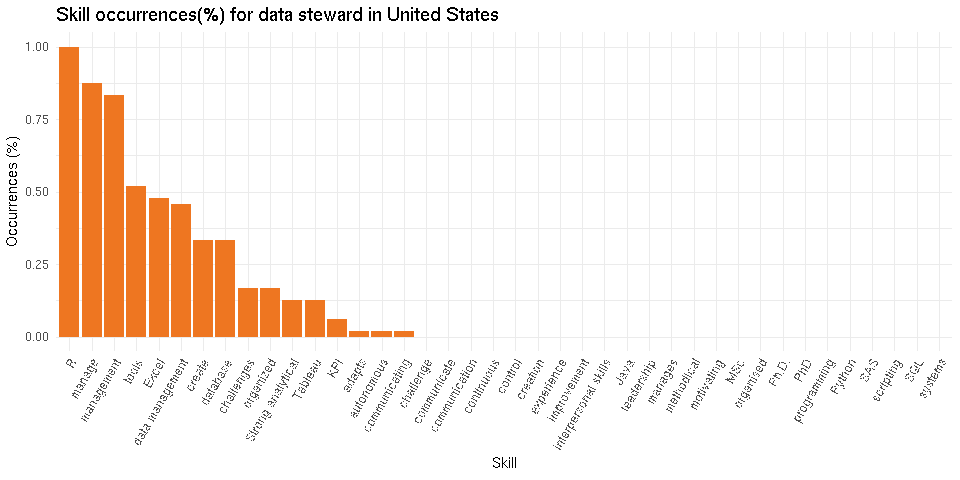

Scrape Data Steward’ skills from Indeed.com
================
August, 2018

## Introduction

Reference - [Job scrapping in R by Steve
liang](https://github.com/steve-liang/DSJobSkill)

based on analysis by Jesse Steinweg-Woods, Ph.D-[Web Scraping Indeed for
Key Data Science Job Skills](https://jessesw.com/Data-Science-Skills/).
The analysis was implemented in Python, and dated 2 years ago.

Here we use R to implement a iterative web scraping from all data
Steward job listings on Indeed.com. I’ll elaborate with code further.

## Indeed’s Advanced Search

Indeed.com is the largest US online job board, with a google-like
interface and search engine, you can drill down by location
[Ghent](https://be.indeed.com/jobs?as_and=data+steward&radius=100&l=ghent&fromage=any&limit=50&sort=date&psf=advsrch)
[Brussels](https://be.indeed.com/jobs?as_and=data+steward&radius=100&l=brussels&fromage=any&limit=50&sort=date&psf=advsrch)
and
[London](https://www.indeed.co.uk/jobs?q=data+steward&l=London&radius=100&fromage=any&limit=50&sort=date&psf=advsrch)
where you can put in your search criteria. Here I want to specify job
title that contains “*data steward*” (this will include senior, junior
or other possible prefix/suffix), at different locations. Additionally I
select display *50* listings per page sorted by *date*. This will help
in our loop operation later on.

After you click **Find Jobs**, it yields a URL with all the specified
fields and brings you to the result page. Take a closer look:

These following fields were assigned and translated into html

  - **\&as\_ttl=** *data+steward*
  - **\&sr=** *directhire*
  - **\&l=** *ghent*

There are several other fields can be assigned, but for our Data steward
specific job analysis, these are good enough. You are encouraged to do
your own criteria trying the other fields. We can start writing some
code now.

## Getting Started with R

``` r
# Load packages
library(rvest)
library(stringr)
library(dplyr)
library(ggplot2)
library(forcats)

# Indeed Search Words
job_title <- "data+steward"
location <- "United+States"
#"brussels"
#"ghent"

# use advanced search to get 50 results in a page
base_URL <- "https://www.indeed.com/"

#"https://be.indeed.com"
#adv_URL <- paste0("https://be.indeed.com/jobs?as_and=&as_phr=&as_any=&as_not=&as_ttl=", job_title, "&as_cmp=&jt=all&st=&radius=100&l=", location, "&fromage=any&limit=50&sort=date&psf=advsrch")

adv_URL <- paste0("https://www.indeed.com/jobs?as_and=&as_phr=&as_any=&as_not=&as_ttl=",
job_title, "&as_cmp=&jt=all&st=employer&salary=&radius=100&l=", location, "&fromage=any&limit=50&sort=&psf=advsrch")
cat(adv_URL)
```

    ## https://www.indeed.com/jobs?as_and=&as_phr=&as_any=&as_not=&as_ttl=data+steward&as_cmp=&jt=all&st=employer&salary=&radius=100&l=United+States&fromage=any&limit=50&sort=&psf=advsrch

Now we’ve found the URL to the search result, we can proceed to next
step.

## Scrape the Search Result

The URL directs you to the first page of the search result, which lists
total number of jobs, first 50 jobs, and links to the 2nd and following
pages at the bottom.

I am using Hadley Wickham’s rvest pacakge for scraping operations. I am
still learning it, but my impression is that this package has many
signature features as other packages from Hadley. For example, the chain
operation using %\>% makes life easier.

``` r
# get the html file from search url
start_page <- read_html(adv_URL)

# get the total job count
job_count <- start_page %>%
  html_node("#searchCount") %>%
  html_text() %>% 
  str_trim(side = "both")
job_count
```

    ## [1] "Page 1 of 62 jobs"

``` r
job_count_total <- 
  unlist(str_split(job_count, " "))[4]
cat("Total job count: ", job_count_total)
```

    ## Total job count:  62

Scraping the job links and page link requires deeper knowledge in html.
I spent quite some time to extract those two parts out. Jobs are under
html nodes:*h2* *a*, links for search result pages are more complex, I
had to use XPath to find them out. It’s almost a must knowing the basic
of html/css. Good lesson for me. Hadley actually pointed out a useful
tool [SelectorGadget](http://selectorgadget.com/) but I didn’t find it
to be effective on Indeed’s website. Indeed’s html appears to be
unstructured. Not sure if they do that on purpose to prevent scarping or
not. Anyhow, the code is much simpler than the process to reach them
properly.

``` r
# Get start page job URLs
links <- start_page %>%
  html_nodes("h2 a") %>%
  html_attr("href")

# Get result page links
page_links <- start_page %>%
  html_nodes(xpath = '//div[contains(@class,"pagination")]//a') %>%
  html_attr("href")


if_else(length(page_links) == 0, "Pages available: 0", paste("Pages available: ", length(page_links)))
```

    ## [1] "Pages available:  2"

## Scrape the Job Descriptions

Now we’ve collected the job links. Without programming, I would click
into the links one by one, read the descriptions line by line. Find out
if I am having a fit, by looking through the skills section. Slow,
inefficient. This time I am going to do it in an automated fashion. It’s
essentially processing a series of text files. Also because I am only
looking at job skills that are comprised by certain keywords. I simply
need to convert the html paragraphs into individual words. If I am
finding a keyword match, I’ll count it once and only once (appearing
multiple times in one single job description doesn’t increase the
importance). By doing this iterating over all jobs, we will gather a
total count(occurrence) of each skill among all jobs.

Before that, I need to come up with a list of job skills that are most
popular/commonly used in Data Scientist
Job.

``` r
KEYWORDS <- c("creation", "create", "created", "communicate", "communicating", 
              "communication", "manage", "manages", "management", "SAS", 
              "Excel", "AWS", "Azure", "Java", "Tableau", "SQL", "data bases", 
              "database", "harvests", "improvement", "KPI", "control", "MSc", 
              "PhD", "experience", "tools", "systems", "autonomous", "methodical",
              "organized", "organised", "Strong analytical", 
              "interpersonal skills", "adapts", "challenge", "challenges",
              "continuous", "data management", "programming", "R", "Python",
              "scripting", "leadership", "motivating")
```

Note that I used \\\\b before ‘SQL’ to prevent double count on ‘NoSQL’.
‘R’ is creating some trouble here, as ‘R’ as a single letter can be
shown in many other words, for example. ‘R’ can be found in location
code ‘OR’ which is Oregan state. ‘Relocation required’ can also
contribute falsely because it appears in the beginning of the phrase. So
using \\\\b to wrap it around would enforce a perfect match of one
single letter ‘R’.

Following is the function that scrapes job description and computes
total job count of each skill

``` r
# Clean the raw html - removing commas, tabs, line changers, etc
clean.text <- function(text) {
  str_replace_all(text, regex("\r\n|\n|\t|\r|,|/|<|>|\\."), " ")
}

# Given running total dataframe and links to scrape skills and compute running total
ScrapeJobLinks <- function(res, job_links) {
  for (i in 1:length(job_links)) {
    job_url <- paste0(base_URL, job_links[i])

    Sys.sleep(1)
    cat(paste0("Reading job ", i, "\n"))

    tryCatch({
      html <- read_html(job_url)
      text <- html_text(html)
      text <- clean.text(text)
      df <- data.frame(skill = KEYWORDS, count = ifelse(str_detect(text, KEYWORDS), 1, 0))
      res$running$count <- res$running$count + df$count
      res$num_jobs <- res$num_jobs + 1
    }, error = function(e) {
      cat("ERROR :", conditionMessage(e), "\n")
    })
  }
  return(res)
}
```

## Actual Scraping

Now we have the function ready, the links to scrape are ready. Let’s run
the procedures.

``` r
# Create running total dataframe
running <- data.frame(skill = KEYWORDS, count = rep(0, length(KEYWORDS)))


# Since the indeed only display max of 20 pages from search result, we cannot use job_count but need to track by creating a num_jobs
num_jobs <- 0

# Here is our results object that contains the two stats
results <- list("running" = running, "num_jobs" = num_jobs)

if (job_count != 0) {
  cat("Scraping jobs in Start Page\n")
  results <- ScrapeJobLinks(results, links)
}

if (length(page_links) > 0) {
  for (p in 1:length(page_links) - 1) {
    cat("Moving to Next 50 jobs\n")

    # Navigate to next page
    new_page <- read_html(paste0(base_URL, page_links[p]))

    # Get new page job URLs
    links <- new_page %>%
      html_nodes("h2 a") %>%
      html_attr("href")

    # Scrap job links
    results <- ScrapeJobLinks(results, links)
    
  }
}
```

Let’s bring up the result sorted in descending order of occurrence:

``` r
# running total
results$running <- 
    results$running %>% 
       arrange(desc(count))
print(results$running)
```

    ##                   skill count
    ## 1               control    54
    ## 2                     R    54
    ## 3                create    53
    ## 4                manage    49
    ## 5            management    48
    ## 6            experience    47
    ## 7         communication    34
    ## 8               systems    31
    ## 9                 Excel    30
    ## 10                tools    29
    ## 11      data management    25
    ## 12          improvement    22
    ## 13             database    18
    ## 14             creation    17
    ## 15                  SQL    15
    ## 16           leadership    14
    ## 17          communicate    12
    ## 18            challenge    12
    ## 19           continuous    12
    ## 20           challenges     9
    ## 21            organized     8
    ## 22    Strong analytical     8
    ## 23                 Java     7
    ## 24              Tableau     7
    ## 25 interpersonal skills     5
    ## 26                  SAS     4
    ## 27                  KPI     3
    ## 28          programming     3
    ## 29              manages     2
    ## 30           methodical     2
    ## 31               adapts     2
    ## 32               Python     2
    ## 33        communicating     1
    ## 34           autonomous     1
    ## 35              created     0
    ## 36                  AWS     0
    ## 37                Azure     0
    ## 38           data bases     0
    ## 39             harvests     0
    ## 40                  MSc     0
    ## 41                  PhD     0
    ## 42            organised     0
    ## 43            scripting     0
    ## 44           motivating     0

It’s more informative to calculate the percentage of apperances, and
visualize it using ggplot.

``` r
# running total count as percentage
results$running$count <- results$running$count / results$num_jobs

# Reformat the Job Title and Location to readable form
jt <- str_replace_all(job_title, '\\+|\\\"', " ")
loc <- str_replace_all(location, "\\%2C+|\\+", " ")

# Visualization
results$running %>% 
    mutate(skill = fct_reorder(skill, -count)) %>% 
    ggplot(aes(x = skill, y = count)) + 
      geom_col(fill = "chocolate2") +
      labs(x = "Skill", y = "Occurrences (%)", 
           title = paste0("Skill occurrences(%) for ", jt, " in ", loc)) +
      #scale_y_continuous(labels = scales::percent, breaks = seq(0, 1, 0.1)) 
    theme_minimal() +
    theme(axis.text.x = element_text(angle = 60, hjust = 1)) 
```

<!-- -->

## Takeaway

## Summary
